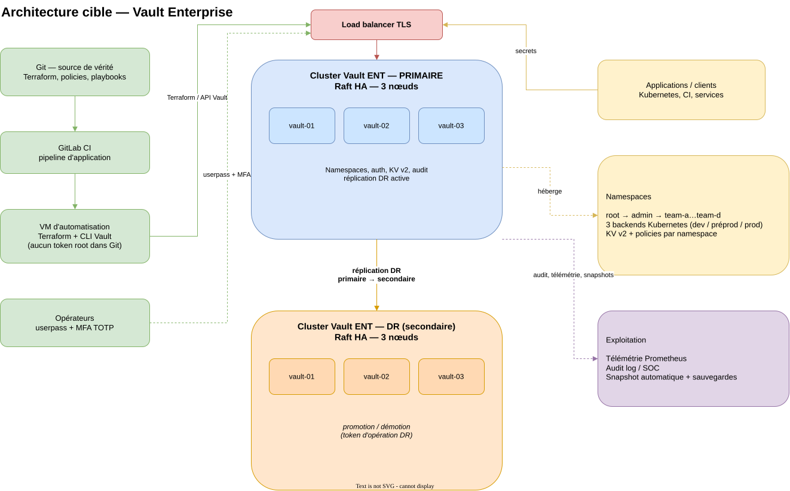

# Lab 2 — Vault Enterprise : namespaces, industrialisation, DR

**Statut : référence non exécutable.** Ce lab rassemble, documente et ordonne des **templates et extraits de code réels** issus de l'industrialisation d'un Vault Enterprise (namespaces, auth Kubernetes, KV v2, audit, snapshot automatique, réplication DR, rekey, snapshot/restore). Il n'y a **ni démonstration tournante, ni licence, ni exécution vérifiée dans ce dépôt** : tout ce qui est présenté ici vient de la PR [wescale/hashistack#167 « Manage enterprise »](https://github.com/wescale/hashistack/pull/167) ou de la documentation HashiCorp, et reste **à adapter** avant usage (voir [`PLAN-executable.md`](PLAN-executable.md)).

> ⚠️ **Aucun secret.** Les fichiers importés ne contiennent ni token, ni clé, ni licence. Un futur lab exécutable devra monter une licence Vault Enterprise **hors dépôt** et n'écrire aucun secret dans Git.

## But

Montrer, à partir de code de production, comment un Vault Enterprise est structuré :

1. **Namespaces** : hiérarchie `root → admin → ns équipes`, policies par namespace.
2. **Authentification** : `userpass` + MFA TOTP pour les opérateurs, 3 backends Kubernetes (un par environnement), machines et humains séparés.
3. **Moteurs de secrets** : montages KV v2 par namespace (`secure-secrets`, `k8s-secrets`).
4. **Exploitation** : audit log, snapshot automatique Raft, rekey, snapshot/restore.
5. **Réplication DR** : cluster primaire / secondaire, promotion et démotion.

## Architecture



*Source éditable : [`architecture/architecture.drawio`](architecture/architecture.drawio) (deux pages : architecture cible, puis namespaces et authentification). Exports : `architecture.svg`/`.png` (page 1) et `architecture-namespaces.svg`/`.png` (page 2). Libellés génériques, aucun nom client ; les noms d'équipes (`team-a`…`team-d`) et le nombre de nœuds (3 par cluster) sont des hypothèses de schéma à ajuster.*

### Vue cible

- **2 clusters Vault Enterprise** en Raft HA (3 nœuds par cluster — hypothèse de schéma, à ajuster) :
  - **primaire** : sert les écritures, derrière un load balancer ;
  - **DR secondaire** : réplication DR du primaire vers le secondaire.
- **Namespaces** : `root` → `admin` (opérateurs, 3 backends Kubernetes dev/préprod/prod) → 4 namespaces d'équipes (`team-a`…`team-d`), chacun avec ses policies, ses montages KV v2 et ses accès.
- **Automatisation** : Git comme source de vérité → runner GitLab CI / VM d'automatisation → Terraform (addons) et CLI Vault ; le duo `userpass`/Terraform porte la configuration, sans token root dans les dépôts.
- **Exploitation** : télémétrie Prometheus, audit log vers le SOC, snapshot automatique et sauvegardes.

### Namespaces et authentification

- `hs_vault_namespaces_list` décrit l'arbre (parent, nom) ; les workspaces Terraform appliquent chaque addon namespace par namespace (`reference/tasks/tf_addons/_namespaces.yml`).
- Les opérateurs s'authentifient en `userpass` avec MFA TOTP obligatoire (`terraform/auth_userpass`).
- Les applications s'authentifient via **3 backends Kubernetes** (dev, préprod, prod), montés dans `admin` et reliés à leurs namespaces.
- Les montages KV v2 sont déclarés par namespace (`terraform/mounts_kvv2`) ; l'audit est activé par namespace (`terraform/audit_logs`).

## Arborescence

| Chemin | Rôle |
|---|---|
| `architecture/` | Schéma d'architecture : source `.drawio` + exports SVG/PNG |
| `terraform/namespaces/` | Module Terraform `vault_namespace` + `vault_policy` (policies HCL incluses) |
| `terraform/auth_userpass/` | Module `userpass` + MFA TOTP (`vault_identity_mfa_totp`, `vault_identity_mfa_login_enforcement`) |
| `terraform/mounts_kvv2/` | Module montages KV v2 (`vault_mount`, `vault_kv_secret_backend_v2`) |
| `terraform/audit_logs/` | Module audit (`vault_audit`, fichier) |
| `reference/tasks/` | Tasks Ansible du rôle `vault` (namespaces, audit, autosnapshot, DR, rekey, snapshot/restore, revoke) |
| `reference/tasks/tf_addons/` | Orchestration Terraform des addons (rendu, `terraform apply` par workspace de namespace) |
| `reference/server/` | `vault-server.hcl.j2` (config serveur, blocs ENT) + `ent-variables.md` (variables ENT extraites) |
| `PLAN-executable.md` | Plan pour transformer cette référence en lab exécutable |

## Provenance des imports

- Source : [wescale/hashistack#167 « Manage enterprise »](https://github.com/wescale/hashistack/pull/167), tête `1eecdb2d364b8ba6f298cf96b014625ab21998bd` (mergée le 2026-01-05).
- Import du **2026-09-30** : `git fetch origin refs/pull/167/head` puis `git show FETCH_HEAD:<chemin>` (aucun checkout, aucune modification du dépôt source).
- **Fidélité vérifiée** : 34 des 35 fichiers importés sont **identiques** au contenu de la PR (`cmp` via `git show`). Le seul écart est documenté ci-dessous.

| Fichiers (lab2) | Source (PR #167) | Remarques |
|---|---|---|
| `terraform/namespaces/**` (10) | `roles/vault/files/namespaces/**` | **1 adaptation** : retrait du `output "test"` (debug `local.parent`) de `main.tf` |
| `terraform/auth_userpass/**` (4) | `roles/vault/files/auth_userpass/**` | verbatim |
| `terraform/mounts_kvv2/**` (3) | `roles/vault/files/mounts_kvv2/**` | verbatim |
| `terraform/audit_logs/**` (3) | `roles/vault/files/audit_logs/**` | verbatim |
| `reference/tasks/**.yml` (11) | `roles/vault/tasks/__*.yml` | verbatim |
| `reference/tasks/tf_addons/**` (4) | `roles/vault/tasks/tf_addons/_*.yml` | verbatim |
| `reference/server/vault-server.hcl.j2` | `roles/vault/templates/vault-server.hcl.j2` | verbatim ; identique à la copie déjà présente dans `../lab1/policies/templates/` |
| `reference/server/ent-variables.md` | `roles/vault/defaults/main.yml`, `roles/vault/vars/main.yml` | extraits verbatim (blocs ENT), coupes marquées |

### Points d'attention relevés à l'import

- `reference/tasks/__dr_cluster_promote.yml:22` : le bloc s'intitule « demote if primary » alors qu'il s'exécute quand `replication_dr_mode == 'secondary'` (nommage hérité, sans effet fonctionnel).
- `reference/tasks/__dr_cluster_promote.yml:70` : commentaire `TBD - key secret_shares + .nonce` laissé dans la source.
- `reference/server/ent-variables.md` : la variable `hs_vault_audit_log_filemane` est bien orthographiée ainsi dans la source (coquille `filemane`).
- Les tasks attendent des variables d'inventaire **absentes du rôle** (`hs_vault_root_operator*`, `hs_vault_local_secret_dir`, `vault_init_content`, licence) : listées dans `reference/server/ent-variables.md`.

## Les modules Terraform en un coup d'œil

### `namespaces` — l'arbre et ses policies

```hcl
resource "vault_namespace" "namespace" {
  count     = (var.namespace == "" || var.namespace == "root") ? 0 : 1
  path      = replace(var.namespace, "#/$#", "")
  namespace = local.parent
}

resource "vault_policy" "policy" {
  for_each  = toset(var.policies)
  namespace = (var.namespace == "" || var.namespace == "root") ? null : vault_namespace.namespace[0].path_fq
  name      = each.key
  policy    = file("${path.module}/policies/${each.key}.hcl")
}
```

Les six policies livrées avec le module : `policy-operator`, `policy-operator-nsadmin`, `policy-operator-childadmin`, `policy-admin-childns`, `policy-secretreader`, `policy-secretwriter`. Le séparateur `#/$#` est la convention de chemin de namespace dans les variables d'entrée.

### `auth_userpass` — humains + MFA

- `vault_auth_backend.human_auth` (type `userpass`, `listing_visibility = "hidden"`, TTL par défaut 2 h / max 16 h) ;
- `vault_generic_endpoint.user` : un utilisateur par entrée de `var.users`, mot de passe généré (`random_password`, ≥ 16 caractères) et exposé seulement en sortie sensible `admin_pass` ;
- `vault_identity_mfa_totp` + `vault_identity_mfa_login_enforcement` : TOTP (SHA256, 6 chiffres, période 30 s) imposé à la connexion.

### `mounts_kvv2` — les secrets applicatifs

Un montage KV v2 par entrée de `var.secret`, avec `max_versions` et `delete_version_after` configurables ; `depends_on` assure la création du montage avant sa configuration.

### `audit_logs` — la trace

`vault_audit.auditlog` de type `file` (chemin par défaut `/opt/vault/logs/audit.log`), activable dans un namespace (`namespace = local.ns`).

## Les tasks Ansible de référence

| Task | Rôle |
|---|---|
| `__create_namespaces.yml` | Crée policies racine, backend `userpass` opérateurs + MFA, puis l'arbre de namespaces (API REST Vault) |
| `__enable_audit.yml` | Active l'audit fichier (répertoire, device) |
| `__enable_autosnapshot.yml` | Configure le snapshot automatique Raft (`snapshot-auto`) |
| `__dr_cluster_promote.yml` | Génère le token d'opération DR et promeut le secondaire |
| `__dr_cluster_demote.yml` | Démote le primaire (`sys/replication/dr/primary/demote`) |
| `__enable_dr_secondary.yml` / `__enable_dr_reco_secondary.yml` | Activation du cluster DR secondaire (flux standard et flux de reprise) |
| `__rekey.yml` | Rotation des clés d'unseal et régénération d'un root token (`generate-root`) |
| `__snapshot.yml` / `__restore.yml` | Sauvegarde `raft snapshot save` + rapatriement local / restauration `raft snapshot restore -force` |
| `__revoke_token.yml` | `auth/token/revoke-self` (fin de vie d'un token d'automatisation) |
| `tf_addons/_namespaces.yml` | Applique le module `namespaces` en workspace Terraform **par namespace** |
| `tf_addons/_mounts_kvv2.yml` | Applique `mounts_kvv2` par namespace (`var.secret`) |
| `tf_addons/_auth_userpass.yml` | Applique `auth_userpass` (opérateurs `hs_vault_root_operator`) |
| `tf_addons/_audit_logs.yml` | Applique `audit_logs` (audit par namespace) |

## Configuration serveur (blocs Enterprise)

`reference/server/vault-server.hcl.j2` est le template `vault.hcl` du rôle, avec les éléments qui distinguent une exploitation Enterprise :

- `storage "raft"` avec `retry_join` TLS (`leader_tls_servername`, certificate/CA) et port Raft dédié (`hs_vault_raft_port`) ;
- listener TLS avec `chroot_namespace` optionnel ;
- `telemetry { prometheus_retention_time = "30s" }` ;
- `license_path` conditionnel (`hs_upload_licence` / `hs_vault_local_license_file`) — **la licence n'est jamais dans le dépôt**.

Les variables correspondantes sont extraites dans `reference/server/ent-variables.md`.

## Vérifications (traçabilité)

Vérifié le **2026-09-30** :

- Import : 34/35 fichiers identiques à la PR (`cmp` avec `git show FETCH_HEAD:<chemin>`), 1 écart documenté (`terraform/namespaces/main.tf`, retrait du `output "test"`).
- Schéma : source `architecture.drawio` (2 pages) exportée par draw.io **31.5.3** (snap) le 2026-09-30 — `drawio -x -f svg -p 1 -o architecture.svg architecture.drawio`, `drawio -x -f png -s 2 -p 1 -o architecture.png architecture.drawio`, puis `-p 2` pour `architecture-namespaces.svg`/`.png` ; rendu PNG inspecté visuellement, aucun élément tronqué.
- Aucun secret : motifs de tokens (`hvs.`/`s.`), clés privées (`BEGIN … PRIVATE KEY`) et chaînes base64 de 100+ caractères — aucun résultat dans `lab2/` ; les seules occurrences de « password », « token » et « license » sont des noms de variables, des libellés ou des chemins de policies.

**Non vérifié dans ce dépôt** : l'exécution des modules Terraform, des tasks Ansible et du flux DR sur un Vault Enterprise (licence absente) — voir le plan ci-dessous.
