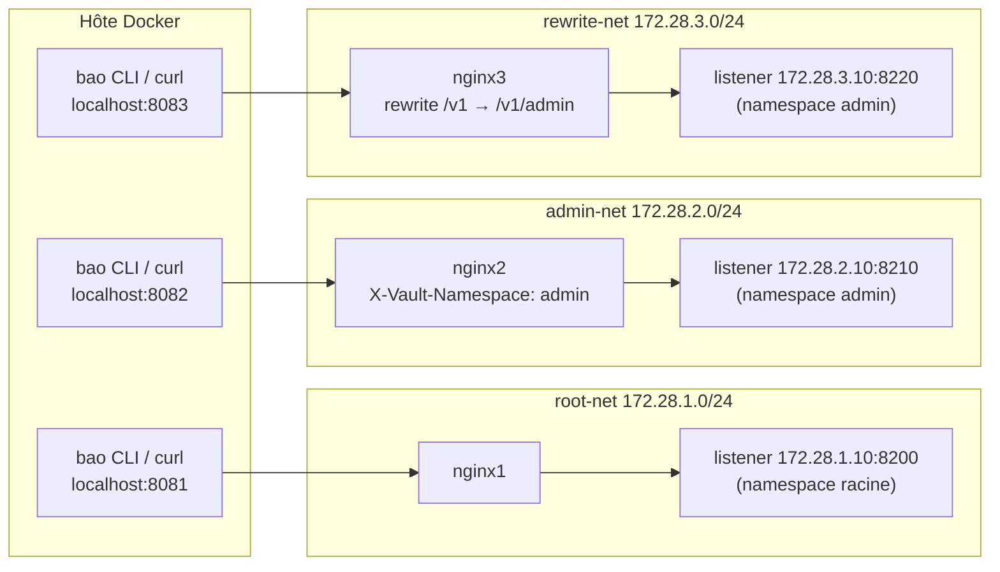

# Lab 3 — OpenBao : un serveur, deux namespaces, trois proxys

**Statut : exécutable localement.** Un serveur OpenBao (stockage Raft), deux namespaces (« racine » et `admin`), trois réseaux Docker et trois proxys nginx : nginx1 expose la racine, nginx2 force `admin` par l'en-tête `X-Vault-Namespace`, nginx3 force `admin` par réécriture du chemin (`/v1/admin/...`) — deux façons d'imposer un namespace sans que le client ait à le connaître.

## But

1. **Namespaces** : la racine (implicite) et un namespace enfant `admin`.
2. **Isolation réseau** : OpenBao a une patte sur chaque réseau, avec un listener lié à l'IP statique de chaque réseau ; nginx1 (`root-net`) parle à `:8200`, nginx2 (`admin-net`) à `:8210`, nginx3 (`rewrite-net`) à `:8220`.
3. **Deux stratégies d'exposition d'un namespace** :
   - nginx2 **injecte** `X-Vault-Namespace: admin` (remplace tout en-tête client) — vaut pour toute l'API et l'UI ;
   - nginx3 **réécrit** `/v1/...` en `/v1/admin/...` (namespace dans l'URL, fonctionnalité OpenBao) et supprime l'en-tête client — API seulement.
4. **Deux `userpass`** : `jm`/`toto` dans la racine, `jm`/`tata` dans `admin`.
5. **KV v2** dans chaque namespace : `secret/supersecret` → `toto` (racine), `tata` (admin).

Aucun port de `bao` n'est publié : l'API n'est joignable qu'à travers les proxys.

## Architecture



| Élément | Détail |
|---|---|
| `bao` | `openbao/openbao:2.5.1`, Raft 1 nœud, **trois réseaux à CIDR fixe**, aucun port publié |
| `root-net` | `172.28.1.0/24` ; bao y a l'IP statique `172.28.1.10`, nginx1 y est le seul autre membre |
| `admin-net` | `172.28.2.0/24` ; bao y a l'IP statique `172.28.2.10`, nginx2 y est le seul autre membre |
| `rewrite-net` | `172.28.3.0/24` ; bao y a l'IP statique `172.28.3.10`, nginx3 y est le seul autre membre |
| listeners | liés aux IP ci-dessus (jamais `0.0.0.0`) : `:8200` n'existe que sur `root-net`, `:8210` que sur `admin-net`, `:8220` que sur `rewrite-net` |
| `nginx1` | publié sur `localhost:8081`, proxifie `http://172.28.1.10:8200` sans en-tête de namespace |
| `nginx2` | publié sur `localhost:8082`, proxifie `http://172.28.2.10:8210` avec `X-Vault-Namespace: admin` |
| `nginx3` | publié sur `localhost:8083`, réécrit `/v1/...` en `/v1/admin/...` vers `http://172.28.3.10:8220` et supprime l'en-tête client ; `/ui/` est proxifiée **sans** réécriture (UI racine, contraste volontaire) ; `/` redirige en 307 vers `/ui/`, le reste → 404 |
| `init` | one-shot : init, unseal, puis création de `admin` et des contenus (userpass, KV v2) |
| volume `bao-data` | état Raft, monté sur `/openbao/file` (chemin que l'entrypoint de l'image `chown` pour l'utilisateur `openbao`) |

> Détail d'OpenBao : chaque listener API ouvre en plus un listener de cluster sur **port+1** (`172.28.1.10:8201`, `172.28.2.10:8211`, `172.28.3.10:8221`) ; `cluster_addr = http://172.28.1.10:8201` pointe sur le premier.
>
> Conséquence de la liaison par IP : Docker isole les bridges en L3, donc chaque proxy ne peut joindre **que** son listener, même en cas de mauvaise configuration — c'est le listener lui-même qui n'accepte que sur son réseau.

## Arborescence

| Chemin | Rôle |
| --- | --- |
| `compose.yaml` | les 5 services, les 3 réseaux, le volume Raft |
| `bao/config/bao.hcl` | config serveur : Raft, listeners 8200/8210/8220, `api_addr`/`cluster_addr` |
| `bao/init/init-bao.sh` | init + unseal + configuration (namespaces, userpass, KV v2) |
| `bao/init/policy-lab3-read.hcl` | policy de lecture du KV v2 (`secret/data/*`, `secret/metadata/*`) |
| `nginx/nginx1.conf` | proxy transparent vers la racine |
| `nginx/nginx2.conf` | proxy admin par en-tête `X-Vault-Namespace` |
| `nginx/nginx3.conf` | proxy admin par réécriture `/v1/...` → `/v1/admin/...` ; `/ui/` non réécrite |
| `architecture/openbao-k8s.drawio` | schéma Kubernetes (illustration) : OpenBao + nginx1/nginx2 dans un cluster, exports `openbao-k8s.svg`/`.png`, repris dans le deck Volcamp |
| `scripts/up.sh`, `scripts/reset.sh` | démarrage (attend l'init) / remise à zéro |
| `runtime/` | clés d'init du serveur — **jamais committé** (gitignore) |

## Prérequis

- Docker avec le plugin Compose ;
- la CLI `bao` (2.5.x) pour les vérifications — l'initialisation, elle, tourne dans un conteneur ;
- les ports `8081`, `8082` et `8083` libres sur l'hôte.

## Démarrage

```console
$ cd lab3
$ ./scripts/up.sh
...
lab3-init  | [init] Initialisation du serveur (1 part de clé, seuil 1)...
lab3-init  | [init] Unseal du serveur...
lab3-init  | [init] Namespace racine : KV v2, userpass (jm/toto), secret/supersecret=toto.
lab3-init  | [init] Namespace admin : KV v2, userpass (jm/tata), secret/supersecret=tata.

OpenBao est prêt :
  nginx1 — namespace racine : http://localhost:8081
  nginx2 — namespace admin  : http://localhost:8082 (X-Vault-Namespace injecté)
  nginx3 — namespace admin  : http://localhost:8083 (chemin /v1/admin réécrit, API seule)
  clés d'init (root token)  : runtime/bao-init.txt — jamais committé
```

À la première exécution, `init` initialise et configure ; aux suivantes, il se contente de désceller le serveur avec la clé conservée dans `runtime/bao-init.txt` (`docker compose down` puis `up.sh` retrouve l'état).

## Vérifications

### 1. Namespace racine via nginx1 — `jm` / `toto`

```console
$ export BAO_ADDR=http://localhost:8081
$ unset BAO_TOKEN BAO_NAMESPACE
$ bao login -method=userpass username=jm password=toto
Success! You are now authenticated. The token information displayed below is
already stored in the token helper. ...
policies               ["default" "lab3-read"]
token_meta_username    jm

$ bao kv get -mount=secret supersecret
==== Data ====
Key      Value
---      -----
value    toto
```

### 2. Namespace admin via nginx2 — `jm` / `tata`

```console
$ export BAO_ADDR=http://localhost:8082
$ unset BAO_TOKEN BAO_NAMESPACE
$ bao login -method=userpass username=jm password=tata
...
token_meta_username    jm

$ bao kv get -mount=secret supersecret
==== Data ====
Key      Value
---      -----
value    tata
```

Le client n'a jamais envoyé d'en-tête de namespace : c'est nginx2 qui a routé la requête vers `admin`.

Même piège que nginx3 pour l'UI : nginx2 exempte les `NAMESPACE_ROOT_URLS` de l'UI (`sys/health`, `sys/seal-status`, `sys/internal/counters/config`) de l'injection d'en-tête, sinon `sys/health` répond `400 operation unavailable in namespaces` et le formulaire de login ne s'affiche pas. Le reste n'est pas touché : login et secrets restent forcés dans `admin`.

### 3. Namespace admin via nginx3 — réécriture de chemin

```console
$ export BAO_ADDR=http://localhost:8083
$ unset BAO_TOKEN BAO_NAMESPACE
$ bao login -method=userpass username=jm password=tata
...
$ bao kv get -mount=secret supersecret
Key      Value
---      -----
value    tata

$ bao status                                          # sys/seal-status est autorisé en namespace
Sealed                  false
```

Ici c'est le **chemin** qui porte le namespace (`/v1/...` réécrit en `/v1/admin/...`) ; l'en-tête client est supprimé par nginx3, donc un client qui envoie `X-Vault-Namespace: root` atterrit quand même dans `admin` :

```console
$ curl -s -o /dev/null -w '%{http_code}\n' -X POST -H 'X-Vault-Namespace: root' \
    -d '{"password":"tata"}' http://localhost:8083/v1/auth/userpass/login/jm
200
```

Contraste volontaire pour l'UI : `/ui/` n'est **pas** réécrite sur nginx3. L'UI est donc servie dans le namespace racine (HTTP 200, `<title>OpenBao</title>`) alors que ses appels API `/v1/` partent, eux, dans `admin` — à observer dans un navigateur. Comme sur les autres proxys, `/` redirige vers `/ui/` (Location relative, sinon nginx perd le port publié) :

```console
$ curl -s -o /dev/null -w '%{http_code}\n' http://localhost:8083/ui/
200
$ curl -sI http://localhost:8083/ | grep -i '^location'
Location: /ui/
```

Piège corrigé : le bundle UI déclare `NAMESPACE_ROOT_URLS = ["sys/health", "sys/seal-status", "sys/internal/counters/config"]` — des endpoints qu'il interroge toujours dans la **racine**. Sans exemption, `/v1/sys/health` était réécrit en `/v1/admin/sys/health` → `400 operation unavailable in namespaces`, et l'UI restait bloquée sur le logo sans formulaire de login. nginx3 les exclut donc de la réécriture :

```nginx
location ~ ^/v1/(sys/health|sys/seal-status|sys/internal/counters/config)$ {
    proxy_pass http://172.28.3.10:8220;
    proxy_set_header X-Vault-Namespace "";
}
```

### 4. Preuves d'isolation (sans le CLI)

```console
$ curl -s -X POST -d '{"password":"toto"}' http://localhost:8082/v1/auth/userpass/login/jm
{"errors":["invalid username or password"]}          # mauvais namespace

$ curl -s -X POST -H 'X-Vault-Namespace: root' -d '{"password":"tata"}' \
    http://localhost:8082/v1/auth/userpass/login/jm | jq -r '.auth.client_token'
s.xxxxxxxx…                                          # nginx2 a ÉCRASÉ l'en-tête « root »

$ curl -s -X POST -d '{"password":"tata"}' http://localhost:8081/v1/auth/userpass/login/jm
{"errors":["invalid username or password"]}          # nginx1 ne connaît pas le mot de passe admin
```

Isolation des réseaux (chaque listener n'est visible que depuis son réseau) :

```console
$ docker exec lab3-nginx2 curl -s -m 4 -o /dev/null -w '%{http_code}\n' \
    http://172.28.1.10:8200/v1/sys/health
000                                                  # timeout (rc=28) : bloqué
$ docker exec lab3-nginx1 curl -s -m 4 -o /dev/null -w '%{http_code}\n' \
    http://172.28.2.10:8210/v1/sys/health
000                                                  # timeout (rc=28) : bloqué
$ docker exec lab3-nginx3 curl -s -m 4 -o /dev/null -w '%{http_code}\n' \
    http://172.28.1.10:8200/v1/sys/health
000                                                  # timeout (rc=28) : bloqué
$ docker exec lab3-nginx1 curl -s -m 4 -o /dev/null -w '%{http_code}\n' \
    http://172.28.3.10:8220/v1/sys/health
000                                                  # timeout (rc=28) : bloqué
```

### 5. Vue opérateur (root token)

```console
$ export BAO_ADDR=http://localhost:8081
$ export BAO_TOKEN=$(awk '/Initial Root Token:/ {print $NF}' runtime/bao-init.txt)
$ bao namespace list
Keys
----
admin/

$ bao secrets list -namespace=admin
Path          Type            Accessor              Description
----          ----            --------              -----------
cubbyhole/    ns_cubbyhole    …                     per-token private secret storage
identity/     ns_identity     …                     identity store
secret/       kv              …                     n/a
sys/          ns_system       …                     system endpoints used for control, policy and debugging
```

## Arrêt et remise à zéro

```console
docker compose down       # arrête, conserve l'état Raft et les clés
./scripts/reset.sh        # arrête et efface volume Raft + runtime/ (clés)
./scripts/up.sh           # redémarre un lab neuf
```

## Notes

- **Le header est le mécanisme à retenir** : `X-Vault-Namespace` est interprété par OpenBao sur chaque requête. Un load balancer, Envoy ou nginx peut donc exposer un namespace comme un endpoint distinct, sans que les clients changent quoi que ce soit (`proxy_set_header` remplace un en-tête client du même nom).
- **Défense en profondeur** : le header route vers le bon namespace *côté proxy*, mais les listeners liés à une IP par réseau garantissent qu'un proxy compromis ou mal configuré ne peut pas atteindre l'autre listener du tout (blocage L3 par Docker, pas par la config OpenBao). Changer les CIDR ou les IP statiques se fait aux deux endroits : `compose.yaml` (`ipam`/`ipv4_address`) et `bao/config/bao.hcl` (`listener`, `api_addr`, `cluster_addr`).
- **`rewrite` au lieu de l'en-tête ?** Oui — c'est l'objet de **nginx3** : OpenBao accepte le namespace en préfixe de chemin d'API (`/v1/admin/...`), alternative documentée à l'en-tête ([concepts namespaces](https://openbao.org/docs/2.5.x/concepts/namespaces/) : « You can also provide an absolute namespace path without using the `X-Vault-Namespace` header »). Deux précautions : le chemin est *relatif* à l'en-tête client (sans neutralisation, `X-Vault-Namespace: admin` + chemin `admin` → `admin/admin` → `permission denied`), d'où `proxy_set_header X-Vault-Namespace "";` ; et la réécriture ne s'applique qu'aux chemins visés (`/v1/`), pas à l'UI (`/ui/`, laissée non réécrite : servie racine, appels API admin). L'injection d'en-tête (nginx2) reste la plus simple et couvre aussi les clients qui envoient déjà un namespace.
- **Schéma Kubernetes (illustration, non exécuté ici)** : `architecture/openbao-k8s.drawio` projette le lab en cluster — OpenBao (Raft), nginx1 et nginx2 dans un même cluster Kubernetes ; nginx1 n'accepte que le cluster voisin (NetworkPolicy), nginx2 que l'in-cluster. C'est le schéma utilisé pour l'Acte 3 du talk Volcamp, pas une stack lancée par ce dépôt.
- **Comparaison avec `chroot_namespace` (Vault Enterprise)** : la doc HashiCorp décrit une option de listener `chroot_namespace` (Vault Enterprise 1.15+) qui fixe le namespace de tête d'un listener ; le namespace envoyé par le client devient alors *relatif* au chroot (`usa-hq` + `X-Vault-Namespace: team_1` → `usa-hq/team_1`) — [Best practices for namespaces and mount paths](https://developer.hashicorp.com/vault/docs/enterprise/namespaces/namespace-structure#chroot-namespace). OpenBao 2.5.1 **ne l'implémente pas** : un listener avec `chroot_namespace = "admin"` démarre avec `[WARN] unknown or unsupported field chroot_namespace` et ignore l'option (testé le 2026-09-30). D'où le choix de l'injection `X-Vault-Namespace` par nginx2, qui ne dépend d'aucune option Enterprise. Nuance : nginx2 *remplace* l'en-tête (namespace absolu `admin`), tandis qu'un chroot rendrait le namespace client relatif (`admin/<client>`).
- Les namespaces sont disponibles dans OpenBao **community** (pas de licence) ; les mounts `ns_*` visibles dans `bao secrets list -namespace=admin` sont ceux du namespace enfant.
- `runtime/bao-init.txt` contient la clé d'unseal et le root token en clair, comme dans tous les labs de ce dépôt : secret local, jamais committé.
- Le serveur tourne sous l'utilisateur `openbao` de l'image (l'entrypoint abandonne root) ; le volume de données est donc monté sur `/openbao/file`, le chemin que l'entrypoint `chown` automatiquement.
- `nginx:latest` sert simple proxy ; `ui = true` rend l'UI OpenBao accessible via `http://localhost:8081/ui/` (racine), `http://localhost:8082/ui/` (admin, en-tête injecté) et `http://localhost:8083/ui/` (non réécrite → racine, alors que les appels `/v1/` de cette même origine partent dans `admin`).

## Traçabilité

Vérifié le **2026-09-30** sur cette machine :

| Composant | Version |
| --- | --- |
| `openbao/openbao` | 2.5.1 (`sha256:87d71502…f93581`) |
| CLI `bao` | 2.5.4 |
| `nginx` | latest (`sha256:5aca9959…2369f6`) |
| Docker / Compose | 29.7.2 / v5.5.0 |

Exécuté et observé :

- init complète depuis un état vierge (Raft + clés supprimés) : `namespaces`, `userpass`, KV v2 créés ; `raft list-peers` → nœud `bao` en `leader` sur `172.28.1.10:8201` ;
- cycle `docker compose down` → `./scripts/up.sh` : le service `init` détecte l'état existant, déscelle et ne reconfigure pas ;
- isolation logique : `jm`/`toto` refusé sur `:8082` et `:8083`, `jm`/`tata` refusé sur `:8081` ; en-tête client `X-Vault-Namespace: root` écrasé par nginx2 (login `tata` accepté, `namespace_path` = `admin/`) et supprimé par nginx3 (login `tata` accepté malgré l'en-tête) ;
- isolation réseau : sous-réseaux `172.28.1.0/24`, `172.28.2.0/24` et `172.28.3.0/24` créés par compose ; appels croisés nginx1/nginx2/nginx3 → timeout (rc=28), chaque proxy ne joint que son listener (les trois adresses effectives `172.28.1.10:8200`, `172.28.2.10:8210`, `172.28.3.10:8220` confirmées par `sys/config/state/sanitized`) ;
- lecture des deux secrets : `toto` via `:8081`, `tata` via `:8082` **et** `:8083` (login CLI et `bao kv get`, `bao status` fonctionnels via la réécriture) ; UI en HTTP 200 sur les trois proxys, celle de nginx3 non réécrite (racine) alors que ses appels `/v1/` partent en admin ;
- nginx2 et nginx3 — UI : `sys/health` passait de `400 operation unavailable in namespaces` (en-tête admin injecté / chemin réécrit en `/v1/admin/...`) à `200` après exemption des `NAMESPACE_ROOT_URLS` ; formulaire de login confirmé visuellement sur nginx3, vérifié au niveau HTTP sur nginx2 ; le forçage reste actif pour le reste (login `tata` → `namespace_path` = `admin/`, KV `tata`) ;
- `chroot_namespace` : absent de la config du lab (aucune occurrence `chroot` dans `lab3/`, `sys/config/state/sanitized` sans cette clé) ; testé sur `openbao/openbao:2.5.1` avec un listener `chroot_namespace = "admin"` → `[WARN] unknown or unsupported field chroot_namespace`, option ignorée (le comportement chroot reste une fonctionnalité Vault Enterprise 1.15+).

**Non vérifié** : comportement multi-nœuds Raft (le lab est volontairement mono-nœud), TLS (listeners en clair, réseau Docker local uniquement).
